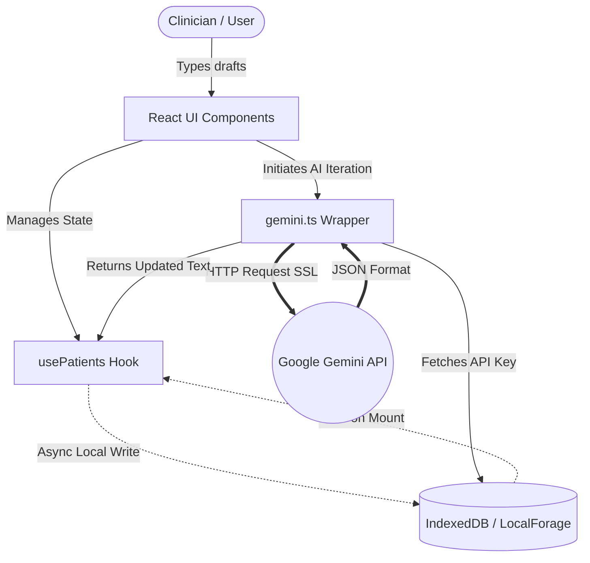
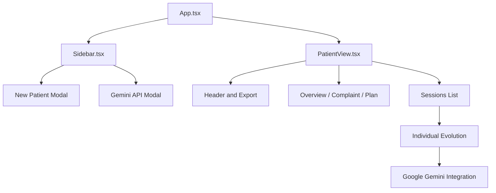
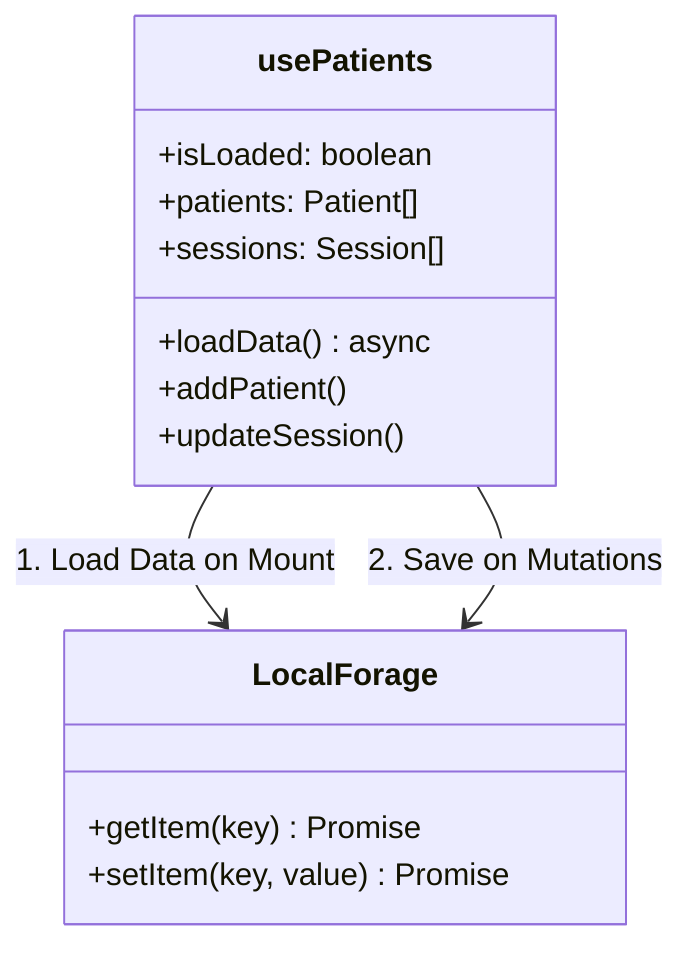
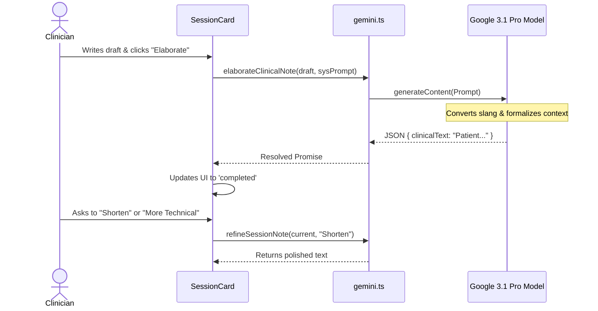
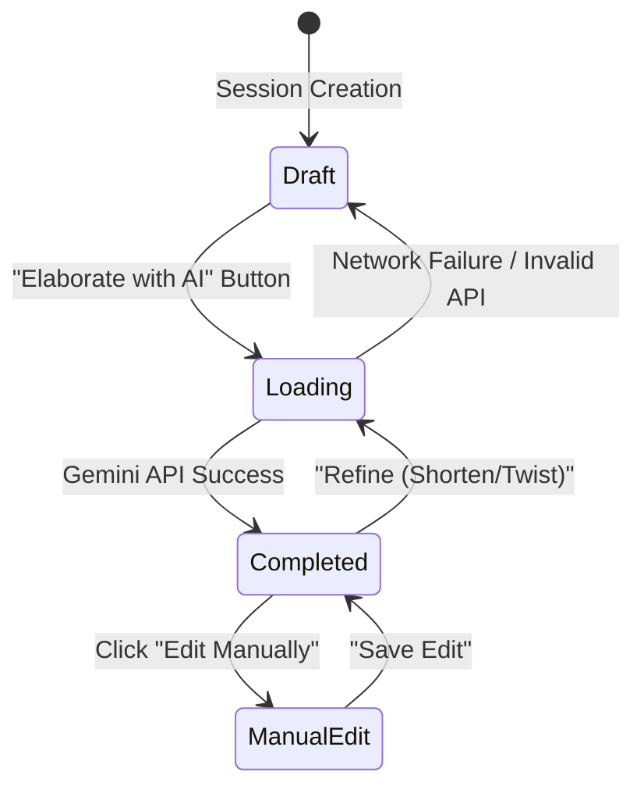

<div align="center">
  
</div>

<br/>

# SalvoProntuário | Intelligent Assistant

**SalvoProntuário** is a "First Class Mobile" web application, custom-designed for psychologists, psychiatrists, and clinical therapists. It accelerates the process and structuring of daily patient evolutions (clinical notes) through the **Google Gemini** artificial intelligence.

The great differentiator of this project is its **Client-Side and Private** nature: All patient data, session notes, and your OpenAI/Gemini API Key are stored **exclusively in the browser** (now utilizing IndexedDB via LocalForage for high performance), ensuring rigorous medical confidentiality and adaptation to the needs of modern clinics, without the need for an obscure backend/server collecting sensitive data.

> ⚠️ **Project Status & Target Audience**: This project is currently in active development and breaking changes may occur at any time. While it is primarily aimed at the Brazilian target audience (pt-BR), we plan to fully support English and Spanish in the future.

---

## ✨ Principles & Goals

The primary goal of SalvoProntuário is to **eliminate the bureaucratic friction of clinical notes**.
Frequently, mental health professionals lose precious hours translating verbal drafts or rushed notes into the technical standards required for psychological and psychiatric evolutions.

1. **Efficiency**: You type "patient said he is sad because he lost his job", the AI transforms it into "Patient reports depressed mood associated with recent job loss..."
2. **Security (Zero-Trust Backend)**: There is no cloud database. The architecture guarantees that sensitive data never leaves your _localhost_, except encrypted via SSL directly to the official Google Gemini API.
3. **Iterativity**: Global chat with the medical record. Summarize months of therapy in seconds.

---

## 🏗 Architecture and Flow (Under the hood)

SalvoProntuário is built as a strongly decentralized React SPA (Single Page Application). To understand the system's mastery, we present **7 Detailed Architectural Diagrams**.

### 1. High-Level Data Flow

The entire flow processes locally, with the UI communicating through a central `usePatients` hook that orchestrates IndexedDB and delegates only heavy textual inferences to the Google Cloud.



### 2. Component Architecture

How the interface dynamically draws patient screens based on the selected state.



### 3. Storage Layer

How we migrated from the old and blocking `localStorage` to the asynchronous high-throughput `IndexedDB` while maintaining the atomic React ecosystem.



### 4. Prompt Iteration Flow

How the magic of transforming disorganized notes into clinical masterpieces happens:



### 5. Secure API Key Management

Client-Side strategy for preserving API secrets.

```mermaid
graph LR
    A[User inputs Key in Modal] --> B[React State: apiKey]
    B --> C[localforage.setItem('geminiApiKey')]
    
    D[User requests AI Generation] --> E[getGemini() in gemini.ts]
    E --> F{Has Key in IDB?}
    F -- Yes --> G[Instantiates GoogleGenAI]
    F -- No (or Failed) --> H[Fallback / UI Error]
```

### 6. Clinical Session State Machine

An evolution/session goes through exact transitions ensuring you never lose work.



### 7. Threat & Privacy Model (Security Model)

Isolating patient data from web crawlers.

```mermaid
graph TD
    Browser[Your Local Browser]
    DB[(IndexedDB - Your Drive)]
    Cloud((Internet / External Servers))
    H[(Hacker / Crawler)]
    
    Browser -- Renders UI --> Browser
    Browser -- Saves/Reads Patients --> DB
    Cloud -. NO PATIENT DATA IS SENT .-> Cloud
    H -. x Blocked by Offline Architecture x .-> DB
    Browser -- API_KEY + TEXT --> Cloud : (Only Valid Gemini Payload)
```

---

## 🛠 Setup Guide

These are the steps in case you want to host the tool locally, run it on your Node.js, or bundle the Web application to run offline!

### Prerequisites

- [Node.js](https://nodejs.org/en) (v18 or newer)
- A package manager (`npm` or `yarn`)

### Available Scripts

```bash
# 1. Clone the project to your computer
git clone <this-repository>

# 2. Enter the project folder
cd prontuario-inteligente

# 3. Install React/Tailwind/Gemini ecosystem dependencies
npm install

# 4. Run the Web application on your localhost (Developer Mode)
npm run dev

# 5. Build packages for web production (if deploying to Vercel/Netlify):
npm run build
```

> **NOTE AFTER RUNNING THE FRONTEND**:
Access `http://localhost:3000` (or the port provided by Vite). Upon opening, click the gear icon in the top left corner and **add your Google Gemini API KEY** to enable the Artificial Intelligence.

---
**Technologies Used:** React 19, Tailwind CSS v4, Lucide React (Icons), LocalForage (IndexedDB Manager), GoogleGenAI SDK, Vite.
